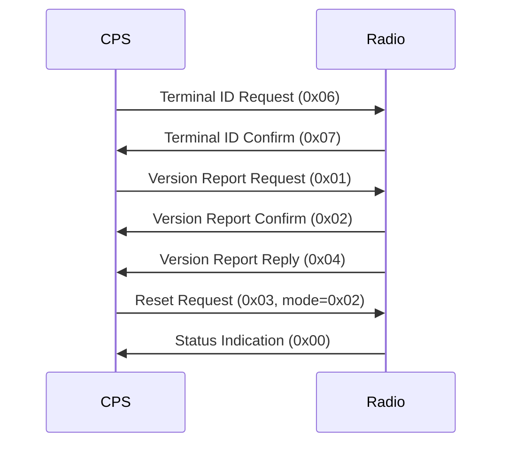

# TETRA Protocol - Quick Reference Card

**One-page cheat sheet for TETRA radio programming protocol**

---

## Message Format

```
[Length: 2 bytes] [Opcode: 1-2 bytes] [Payload: variable] [Checksum: 2 bytes]
```

---

## RP Protocol Commands (8-bit opcodes)

| Command | Opcode | Direction | Payload |
|---------|--------|-----------|---------|
| Status Indication | `0x00` | Radio→CPS | Status bytes |
| Version Report Request | `0x01` | CPS→Radio | - |
| Version Report Confirm | `0x02` | Radio→CPS | - |
| Reset Request | `0x03` | CPS→Radio | Mode (1 byte) |
| Version Report Reply | `0x04` | Radio→CPS | Version info |
| Reject Indication | `0x05` | Radio→CPS | Reason code |
| Terminal ID Request | `0x06` | CPS→Radio | - |
| Terminal ID Confirm | `0x07` | Radio→CPS | ID string |

### Reset Modes
- `0x00` = Normal
- `0x01` = Charging  
- `0x02` = Programming
- `0x03` = RP Mode

---

## Data Transfer Commands (16-bit opcodes)

### Read Operations
| Command | Opcode | Payload |
|---------|--------|---------|
| Read Data Request | `0xF511` | addr(4), len(2) |
| Read Data Reply | `0xFF80` | data, checksum(2) |
| Extended Read Request | `0xF741` | addr(4), len(2) |
| Extended Read Reply | `0xFFB0` | data, checksum(2) |

### Write Operations
| Command | Opcode | Payload |
|---------|--------|---------|
| Write Data Request | `0xFF17` | addr(4), len(2), data, cs(2) |
| Good Write Reply | `0xF484` | - |
| Bad Write Reply | `0xF485` | - |
| Extended Write Request | `0xFF47` | addr(4), len(2), data, cs(2) |
| Extended Good Reply | `0xF5B4` | - |
| Extended Bad Reply | `0xF5B5` | - |

### Utility Operations
| Command | Opcode | Payload |
|---------|--------|---------|
| Checksum Request | `0xF612` | addr(4), len(2) |
| Checksum Reply | `0xF381` | checksum(2) |
| Status Request | `0xF114` | - |
| Status Reply | `0xF583` | status bytes |
| Configuration Request | `0xF113` | - |
| Configuration Reply | `0xF482` | config data |
| Unsupported Opcode | `0xF186` | - |

---

## SBEP Protocol

### Status Codes
- `0x50` = ACK (acknowledged)
- `0x60` = NACK (not acknowledged)
- `0x70` = Undefined

---

## Connection Sequence



---

## FDT Record Types

| ASCII | Hex | Purpose |
|-------|-----|---------|
| FDTR | `0x46445452` | FDT Record Header |
| CPLG | `0x43504C47` | Codeplug Data |
| KEYS | `0x4B455953` | Encryption Keys |
| LOGD | `0x4C4F4744` | Log Data |
| RELI | `0x52454C49` | Release Information |
| FSPK | `0x4653504B` | Flash Pack |
| FMWR | `0x464D5752` | Firmware |

---

## Compression Types

| Value | Algorithm |
|-------|-----------|
| `0x00` | No compression |
| `0x01` | LZRW3 |
| `0x02` | FastLZ |
| `0xFF` | LZRW3A |

---

## Example: Read Codeplug at 0x00010000, 256 bytes

```
Request:  F5 11 00 00 01 00 00 01 XX XX
          │  │  └────┬────┘ └──┬──┘ └─┬─┘
          │  │   Address    Length  Checksum
          │  └─ Opcode (Read Data Request)
          └─ Length prefix

Response: FF 80 [256 bytes of data] XX XX
          │  │                       └─┬─┘
          │  │                      Checksum
          │  └─ Opcode (Read Data Reply)
          └─ Length prefix
```

---

## Example: Write 16 bytes to 0x00020000

```
Request:  FF 17 00 00 02 00 10 00 [16 data bytes] XX XX
          │  │  └────┬────┘ └─┬─┘               └─┬─┘
          │  │   Address    Length             Checksum
          │  └─ Opcode (Write Data Request)
          └─ Length prefix

Response: F4 84
          │  └─ Opcode (Good Write Reply)
          └─ Length prefix

Or:       F4 85
          │  └─ Opcode (Bad Write Reply)
          └─ Length prefix
```

---

## Error Handling

| Layer | Error Indication |
|-------|------------------|
| RP | Reject Indication (`0x05`) |
| SBEP | NACK (`0x60`) |
| Data | Bad Write Reply (`0xF485`) |
| Any | Unsupported Opcode (`0xF186`) |

---

## Security Features

### Authentication
- Password validation before programming
- Multi-step version exchange
- Terminal ID verification

### Encryption
- Dual-key system (encrypt + auth)
- Key storage in FDT KEYS section
- Encrypted firmware downloads

### Integrity
- Checksums on all data transfers
- HMAC/CMAC for authentication
- Version checking before operations

---

## Common Mistakes

❌ **Don't:**
- Skip version exchange
- Use wrong reset mode
- Ignore checksums
- Mix standard/extended opcodes

✅ **Do:**
- Always exchange version info first
- Use reset mode `0x02` for programming
- Validate all checksums
- Prefer extended opcodes for large transfers
- Handle all error responses

---

## Typical Programming Flow

```
1. Connect to radio (USB/serial)
2. Send Terminal ID Request (0x06)
3. Receive Terminal ID (0x07)
4. Exchange version info (0x01, 0x02, 0x04)
5. Send Reset to Programming Mode (0x03, mode=0x02)
6. Read FDT to get memory layout
7. Read codeplug sections (0xF511/0xF741)
8. Modify codeplug data
9. Write codeplug sections (0xFF17/0xFF47)
10. Verify with checksums (0xF612)
11. Reset to Normal Mode (0x03, mode=0x00)
```

---

## Debug Tips

### Capture Traffic
```bash
# On Linux with usbmon
sudo modprobe usbmon
sudo wireshark

# Filter by USB vendor/product ID
usb.idVendor == 0x0db9  # Motorola
```

### Check Checksums
```python
def tetra_checksum(data):
    # Standard 16-bit checksum (to be verified)
    sum = 0
    for byte in data:
        sum = (sum + byte) & 0xFFFF
    return sum ^ 0xFFFF
```

### Validate Opcodes
```python
RP_OPCODES = {
    0x00: "STATUS_IND",
    0x01: "VERSION_REQ",
    # ... etc
}

if opcode in RP_OPCODES:
    print(f"RP: {RP_OPCODES[opcode]}")
else:
    print(f"Unknown opcode: 0x{opcode:02X}")
```

---

## References

- Full spec: [TETRA-Protocol-Analysis.md](./protocols/TETRA-Protocol-Analysis.md)
- Security: [TETRA-Security-Analysis.md](./protocols/TETRA-Security-Analysis.md)
- Index: [protocols/README.md](./protocols/README.md)

---

**Version:** 1.0  
**Date:** 2026-01-29  
**Analyst:** Specter

